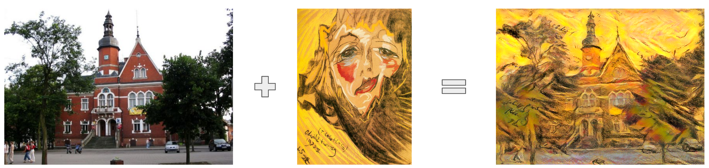

# Neural-Style-Transfer
Source code for the student lecture "neural style transfer" as part of the "Artificial Intelligence" course at the Wrocław University of Technology.

This repo bases on original Neural Style Transfer paper (Gatys et al. 2015): https://arxiv.org/abs/1508.06576

## Examples
Style transfer allows us to create an image of certain thing (content image) with certain style (style image).
Check out how awesome it is!



## How to use
Code will create new folder for your content image, saves the final image, but also creates a gif file.

### Installation
```
pip3 install -r requirements.txt
```

### Use script
The configuration file is in the config folder. 
Key parameters are: content_img (image A) and style_img (image with reference style).
This repository uses a Hydra framework, so can modify this in default.yaml file itself, but also you can 
pass the parameters from command line for example:
```
python style_transfer.py style_img='examples/style/starry_night.jpg'
```

## Acknowledgments
* Original paper:
```
@article{gatys2015neural,
  title={A neural algorithm of artistic style},
  author={Gatys, Leon A and Ecker, Alexander S and Bethge, Matthias},
  journal={arXiv preprint arXiv:1508.06576},
  year={2015}
}
```
* Great tutorial about NST that helped me a lot is [here](https://www.youtube.com/watch?v=B22nIUhXo4E)
